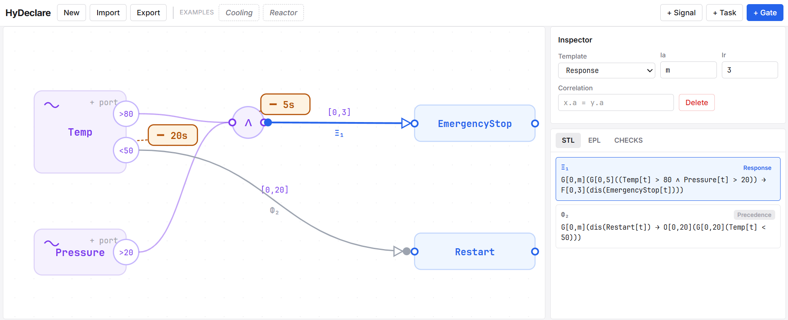

# HyDeclare Editor

A browser-based graphical editor for **hybrid declarative process specifications**. 



This editor allows you to model hybrid constraints over discrete task events and continuous sensor signals, compiling them to **Signal Temporal Logic (STL) formulas** and **Esper EPL rules** for real-time monitoring and enforcement.

The canvas is built on **React Flow** (`@xyflow/react`) for layout and interactivity.

## The Executable Core

The notation is larger than what this editor compiles. A model is in the
**executable core** when every constraint uses one of `Existence` (with the
cardinality `1..*`), `NotExistence`, `Response`, `Precedence`, `Succession`
or `RespondedExistence`, without an alternate or chain strengthening. Ports,
nested junctions, sustain durations, metric windows and correlation conditions
are all supported inside it, and compilation there is deterministic and total.

The remaining constructs — the alternate and chain strengthenings, and
cardinalities `n..m` with `n > 1` — are part of the language and are perfectly
well-formed, but this compiler does not expand them. The editor therefore does
not offer them: you cannot draw one. A model that carries one (a hand-written
or generated JSON file, loaded through **Import**) is accepted, drawn and
reported under CHECKS as *outside the executable core*, and no EPL is emitted
for it. Well-formedness (WF1–WF5, a property of the language) and core coverage
(a property of this compiler) are reported as two separate lists and never
conflated.

`RespondedExistence` is the one order-free binary template: its target may
occur before or after the activation and carries no deadline, so it takes no
response window `Ir`, and an unmet obligation stays pending rather than
expiring. Bounding it forward would make it a `Response`.

Run `npm test` to check the compiler against the formulas published for the
example models, and to check that the four binary templates still compile to
four different rule sets.

## Quick Start

You can run the editor locally using either `npm` or `pnpm` (which is configured in the repository workspace).

### 1. Run Locally

```bash
# Install dependencies
pnpm install # or: npm install

# Start the dev server
pnpm dev     # or: npm run dev
```

Open [http://localhost:3000](http://localhost:3000) in your browser.

### 2. Docker Deployment

Deploy in containerized environment:

```bash
docker compose up -d
```


## Model JSON Format

HyDeclare models are stored as plain JSON:

```jsonc
{
  "signals":    [{ "id": "s1", "name": "Temp", "x": 80, "y": 140 }],
  "ports":      [{ "id": "p1", "signal": "s1", "op": ">", "k": 90, "delta": 10 }],
  "junctions":  [{ "id": "j1", "op": "AND", "members": ["p1", "p2"], "delta": 5, "x": 330, "y": 150 }],
  "activities": [{ "id": "a1", "name": "EmergencyStop", "x": 540, "y": 128 }],
  "constraints": [{ "id": "Ξ₁", "type": "Response", "theta1": "j1", "theta2": "a1", "Ia": [0,"m"], "Ir": [0,3] }]
}
```

A constraint may also carry `"strength": "alternate" | "chain"`, and an
`Existence` tag may carry `"n"` and `"m"`. Both are read on import and both put
the constraint outside the executable core.
